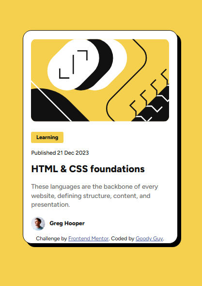

# Frontend Mentor - Blog preview card solution

This is a solution to the [Blog preview card challenge on Frontend Mentor](https://www.frontendmentor.io/challenges/blog-preview-card-ckPaj01IcS). Frontend Mentor challenges help you improve your coding skills by building realistic projects.

## Table of contents

- [Overview](#overview)
  - [The challenge](#the-challenge)
  - [Screenshot](#screenshot)
  - [Links](#links)
- [My process](#my-process)
  - [Built with](#built-with)
  - [What I learned](#what-i-learned)
  - [Continued development](#continued-development)
  - [Useful resources](#useful-resources)
  - [AI Collaboration](#ai-collaboration)
- [Author](#author)

## Overview

### The challenge

Users should be able to:

- See hover and focus states for all interactive elements on the page

### Screenshot



### Links

- Solution URL: [My Solution Url](https://github.com/Goodyguy-star/Blog-preview-card)
- Live Site URL: [My Live Site Url](https://goodyguy-star.github.io/Blog-preview-card/)

## My process

### Built with

- Semantic HTML5 markup
- CSS custom properties
- Flexbox

### What I learned

I'm happy with how my HTML turned out, especially getting everything structured properly so the CSS could do its job.

Using the wildcard selector (`*`) to reset margins, padding, and set `box-sizing: border-box` made a huge difference. It gave me way more predictable measurements. Also, `display: flex` on the body made centering the card on the screen incredibly easy.

Here are the code snippets:

```html
<link rel="stylesheet" href="style.css" />
```

```css
*,
::before,
::after {
  margin: 0;
  padding: 0;
  box-sizing: border-box;
}

body {
  font-family: "Figtree", sans-serif;
  background-color: hsl(47, 88%, 63%);
  display: flex;
  flex-direction: column;
  align-items: center;
  justify-content: center;
  min-height: 100vh;
}
```

### Continued development

I would love to further my development on various pseudo classes and elements.

### Useful resource

- [freeCodeCamp](https://www.freecodecamp.org) - This helped me remember the usage of various pseudo classes.

### AI Collaboration

I used Gemini to help debug a few issues when I got stuck. It really helped me understand how file paths (`./` vs `../`) work in real projects and how to fix text overflowing out of layout containers.

## Author

- Frontend Mentor - [@Goodyguy-star](https://www.frontendmentor.io/profile/Goodyguy-star)
- Twitter - [@GNduchekwe4544](https://x.com/GNduchekwe4544)
